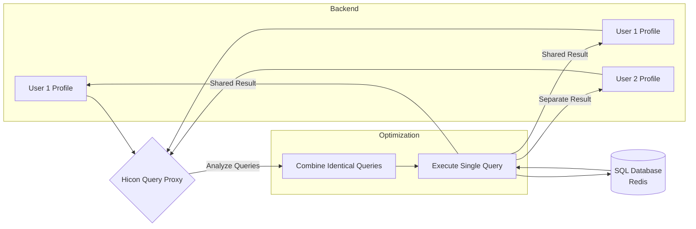

```mermaid
flowchart LR
    subgraph Backend
        B1[User 1 Profile]
        B2[User 1 Profile]
        B3[User 2 Profile]
    end

    QP{Hicon Query Proxy}

    subgraph Optimization
        direction TB
        combine[Combine Identical Queries]
        execute[Execute Single Query]
    end

    DB[(SQL Database\nRedis)]
    B1 & B2 --> QP
    B3 --> QP
    QP -->|Analyze Queries| combine
    combine --> execute
    execute --> DB
    DB --> execute
    execute -->|Shared Result| B1
    execute -->|Shared Result| B2
    execute -->|Separate Result| B3
```
