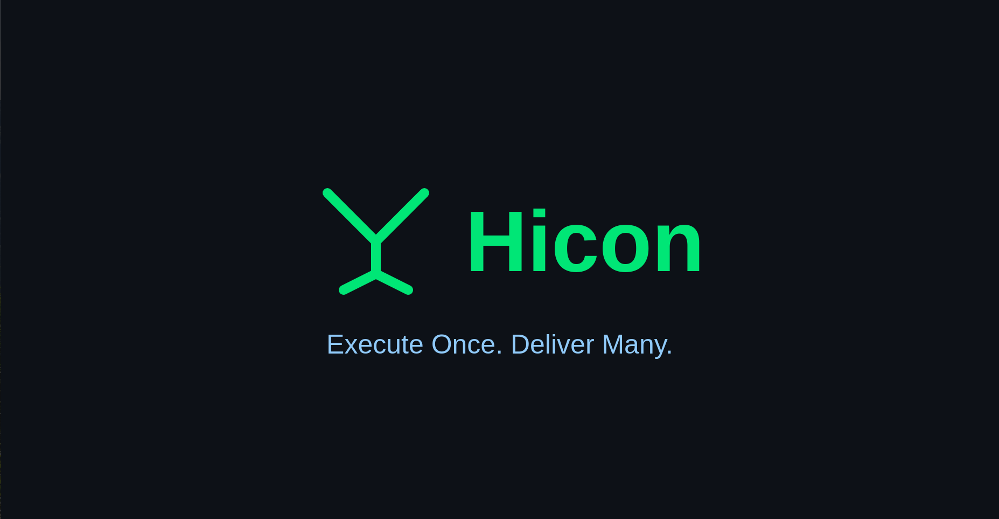
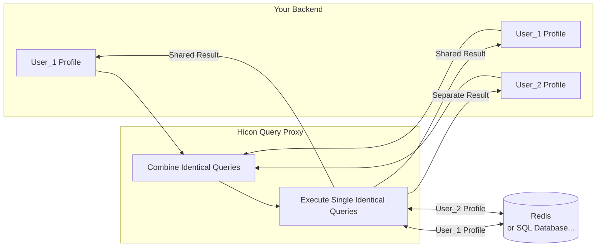

## [Flowchart]

## Core Features

- [x] Built-in query builder use BunORM for security.
- [x] Combine identical queries into single query in the same time.
- [x] Cache connections in pool.
- [x] Support for multi DBs: MySQL, Postgresql.
- [x] Connect with your Redis for better performance.
- [x] Optimized Redis cache size memory if using built-in query builder.
- [x] Client SDK for NodeJS, Golang.
- [x] Debug logging with your X-Request-Id.
- [x] Disable cache at global and per request.
- [x] Custom your lock key with write actions.
- [x] Bulk write operations with transactions.

## Backlogs

- [ ] Support for Oracle.
- [ ] Unit test.
- [ ] SDK for PHP, C#, Ruby...
- [ ] OpenTelemetry.
